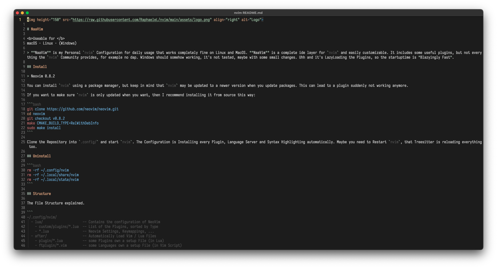

# My Vidid

My Vivid is a color scheme for Neovim. It has no background color, so it is transparent and takes the color of the terminal.

## Usage 

with [folke/lazy.nvim](https://github.com/folke/lazy.nvim)

> Optional: You can set `event = "VeryLazy"` to Extrem Lazy Load the Colorscheme without any optical issues.

```
return {
    {
        "RaphaeleL/my_vivid",
    }
}
```

## Configuration

```
vim.cmd("colorscheme my_vivid")
```

Personal Adjustments can be done like this:

```
vim.cmd("hi @field guifg=#89A5AC")
vim.cmd("hi @parameter guifg=#77B0DA")
```

## Showcase



